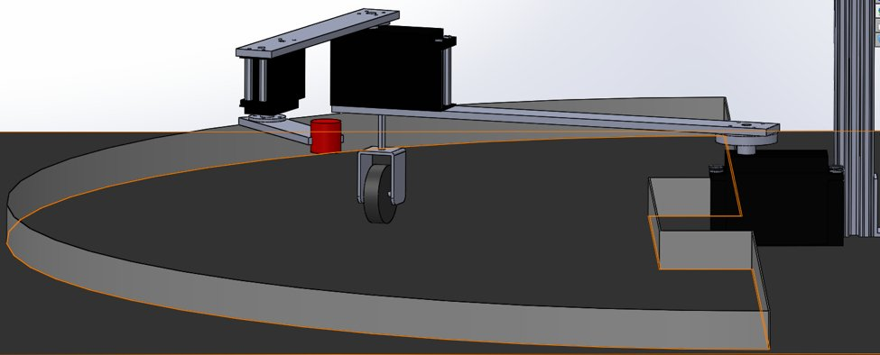
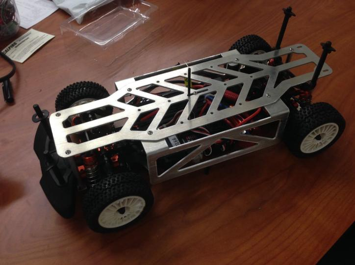

<h3> Steven van Leeuwen </h3> 
Project Page  
   <em> 41777 Grimmer Blvd Apt F3 Fremont, CA 94538 </em> | <em> +17606259802 </em> | <em> svanleeuwen93@gmail.com </em>

<h3> Research and Projects </h3>
<h4> Satellite Descent to Asteroid Surface with Sensor Modeling and 6dof Dynamics </h4>
picture (trajectory based)
<h4> Reachability-Based Trajectory Design </h4>
link to code and picture (trajectory based)
<h4> "The Intelligent Arm" Robot </h4>

link to website
<h4> Berkelely Autonomous Race Car (BARC) </h4>

link to website
<h4> Comparison of Differnet Steering Control Strategies </h4>
just description
<h4>Mobile Gates for Congested Airports </h4>
just description
<h3> Publications </h3>
links

