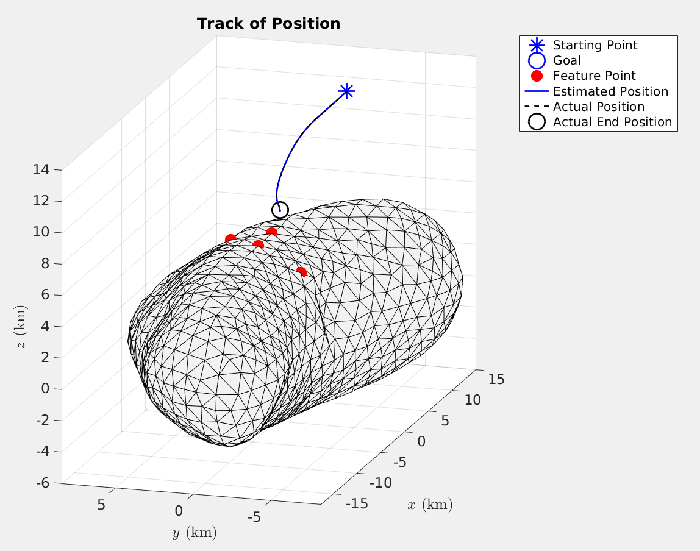
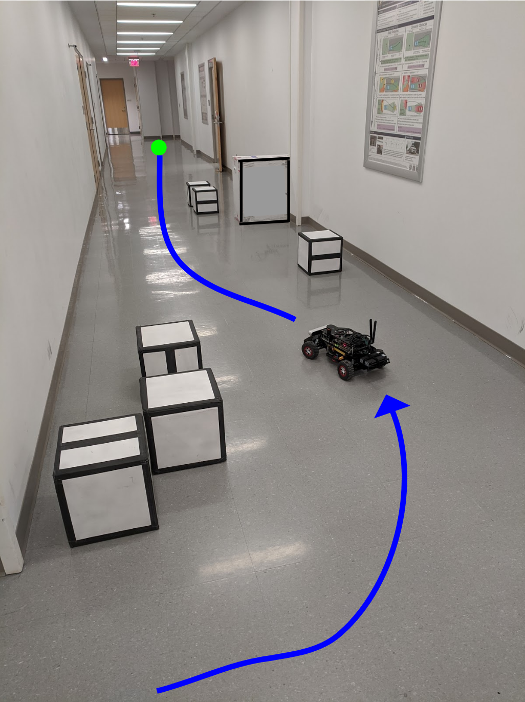

   <em> +17606259802 </em>   <em> svanleeuwen93@gmail.com </em>

<h2> Research and Projects </h2>
-- -- More recent -- --
<h4> Spacecraft Near Asteroid Optimal Control </h4>
  
Control of spacecraft descent and landing on an asteroid surface. Control techniques explored include MPC and reference signal governors or modulators. Creation of a measurement model fusing imu, strapped-down optical camera capturing surface feature markers, and lidar sensors. Simulation consisiting of 6dof plant model and EKF. Treatment of uncertainty and constraints, including chance-based constraints, in the controller scheme design. An important constraint for this asteroid/spacecraft setting is soft landing. [arXiv]()
<h4> Reachability-Based Trajectory Design </h4>
  
Additional developments of a trajectory planning method with safety guarantees known as Reachability-based trajectory design. Implementation on a 1:10 scale RC car, including low level controller design, SLAM, and high level path planning in the online pipeline. Processing of obstacles in the environment as constraints in optimization. Investigation of numerical techniques and convex representations of obstacles and reachability sets to make online performance faster. [Code](https://github.com/ramvasudevan/roahm-rover) [Video]()    
 -- -- Less recent -- --
<h4> "The Intelligent Arm" Robot </h4>
  
Three-linkage mechanical arm with camera object tracking, conception to demo. Proportional feedback control. [Website](https://danielfmcms.wixsite.com/me102bintelligentarm)
<h4> Berkeley Autonomous Race Car (BARC) </h4>
  
1:10 scale RC car modification for autonomous drive. Codeveloped prototype vehicle- body assemblies, software
code for actuators, IMU filtering, tire force model, documentation. [Website](https://barc-project.com)
<h4> Comparison of Different Steering Control Strategies on Highway </h4>
Development and comparison of a Sliding Mode and Model Predictive Controller for vehicle lane keeping and
obstacle avoidance maneuvering in simulation while enrolled in honors undergraduate research.
<h4>Mobile Gates for Congested Airports </h4>
Researched mobile gate design concept to improve airport efficiency with professor-led team. Devised movable and
detachable jet bridge connections to terminal building. Project award in nationwide competition.
<h2> Publications </h2>
links

