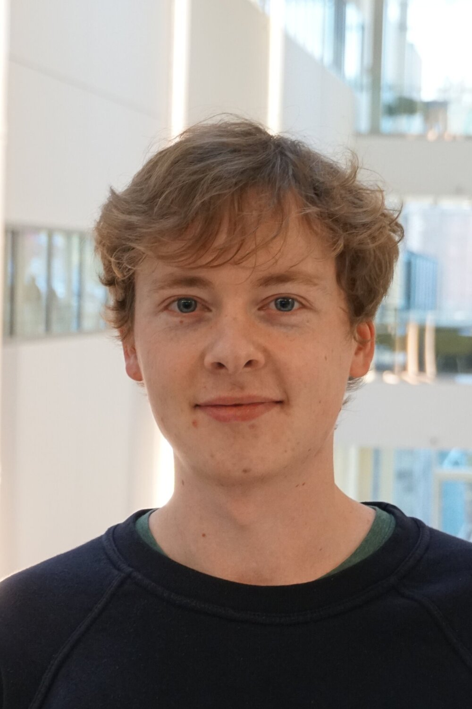
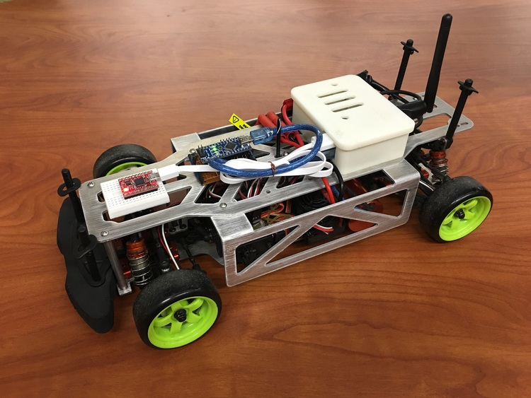

   <em> 17606259802 </em>   <em> svanleeuwen93@gmail.com </em>  
You have landed on my project page. Broadly speaking, I am interested in control design of maneuvering vehicles. More specifically, I enjoy working on constrained control problems and using optimization techniques. I have interest in wheeled, drone, and spacecraft platforms.
<h2> Research and Projects </h2>
<h4> Spacecraft Near Asteroid Optimal Control </h4>
  
Control of spacecraft descent and landing on an asteroid surface. The focus of this work is using MPC and convexification approaches to control of nonlinear stochastic dynamic systems and formulating this with estimation. Creation of a measurement model fusing imu, strapped-down optical camera capturing surface feature markers, and lidar sensors. Simulation consisiting of 6dof plant model and EKF. Exploration of reference modulators/governors and stochastic MPC, including chance-based constraints, in the controller scheme design. Examples of important constraints for this asteroid/spacecraft scenario are soft landing and field of view constraints. I have also worked on this spacecraft scenario with NMPC. [arXiv]()    
 -- -- -- Less recent -- -- --
<h4> Reachability-Based Trajectory Design </h4>
  
Additional developments of a trajectory planning method with safety guarantees known as Reachability-Based Trajectory Design. Implementation on a 1:10 scale RC car, including low level controller design, SLAM, and high level path planning in the online pipeline. Processing of obstacles in the environment as constraints in optimization. Investigation of numerical techniques to make online performance faster, along with software tuning for the hardware. [Code](https://github.com/ramvasudevan/roahm-rover)    
<h4> "The Intelligent Arm" Robot </h4>
  
Three-linkage mechanical arm with camera object tracking, conception to demo. Proportional feedback control. [Website](https://danielfmcms.wixsite.com/me102bintelligentarm)    
<h4> Berkeley Autonomous Race Car (BARC) </h4>
  
1:10 scale RC car modification for autonomous drive. Codeveloped prototype vehicle- body assemblies, software
code for actuators, IMU filtering, tire force model, documentation. [Website](https://barc-project.com)    
<h4> Comparison of Different Steering Control Strategies on Highway </h4>
Development and comparison of a Sliding Mode and Model Predictive Controller for vehicle lane keeping and
obstacle avoidance maneuvering in simulation while enrolled in honors undergraduate research.    
<h4>Mobile Gates for Congested Airports </h4>
Researched mobile gate design concept to improve airport efficiency with professor-led team. Devised movable and
detachable jet bridge connections to terminal building. Project award in nationwide competition. [Link](https://airportdesign.berkeley.edu/education/student-awards)

